# Architecture

Developer reference for holon.nvim internals.

## Module Layers

```mermaid
graph TD
    subgraph Entry Points
        plugin["plugin/holon.lua"]
    end

    subgraph UI Layer
        zkpickers["zk/pickers.lua"]
        linkbrowser["zk/link_browser.lua"]
        gtdboard["gtd/board.lua"]
    end

    subgraph Service Layer
        zkfinders["zk/finders.lua"]
        zkactions["zk/actions.lua"]
        gtdfinders["gtd/finders.lua"]
        gtdstate["gtd/state.lua"]
    end

    subgraph Domain Layer
        frontmatter["frontmatter.lua"]
        links["links.lua"]
        graph["graph.lua"]
        makeentry["zk/make_entry.lua"]
        gtdrender["gtd/render.lua"]
        gtdtimeline["gtd/timeline.lua"]
    end

    subgraph Infrastructure
        config["config.lua"]
        utils["utils.lua"]
        filesearch["file_search.lua"]
        picker["picker.lua"]
    end

    plugin --> zkpickers
    plugin --> zkactions
    plugin --> linkbrowser
    plugin --> gtdboard

    zkpickers --> zkfinders
    zkpickers --> zkactions
    zkpickers --> makeentry
    zkpickers --> picker

    linkbrowser --> links
    linkbrowser --> frontmatter
    linkbrowser -.->|lazy| zkfinders

    gtdboard --> gtdstate
    gtdboard --> gtdrender
    gtdboard --> gtdtimeline
    gtdboard -.->|lazy| zkactions

    gtdstate --> gtdfinders
    gtdstate --> links

    zkfinders --> filesearch
    gtdfinders --> filesearch

    makeentry --> frontmatter
    zkfinders --> frontmatter
    zkactions --> frontmatter
    zkactions --> links
```

`config.lua` and `utils.lua` are infrastructure modules used by all layers.
`init.lua` is a facade that lazy-loads all modules via metatable.

Each layer only depends on the layers below it. There are no upward or
same-layer dependencies. Dashed arrows indicate lazy (deferred) dependencies.

## Initialization

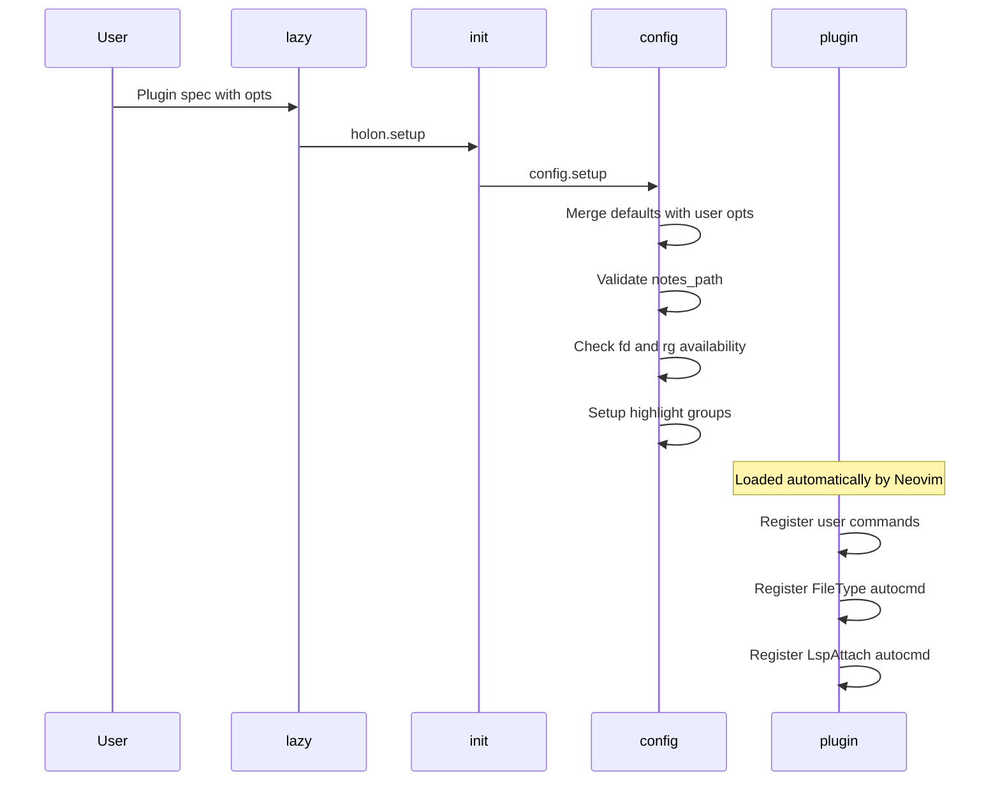

## Note Search

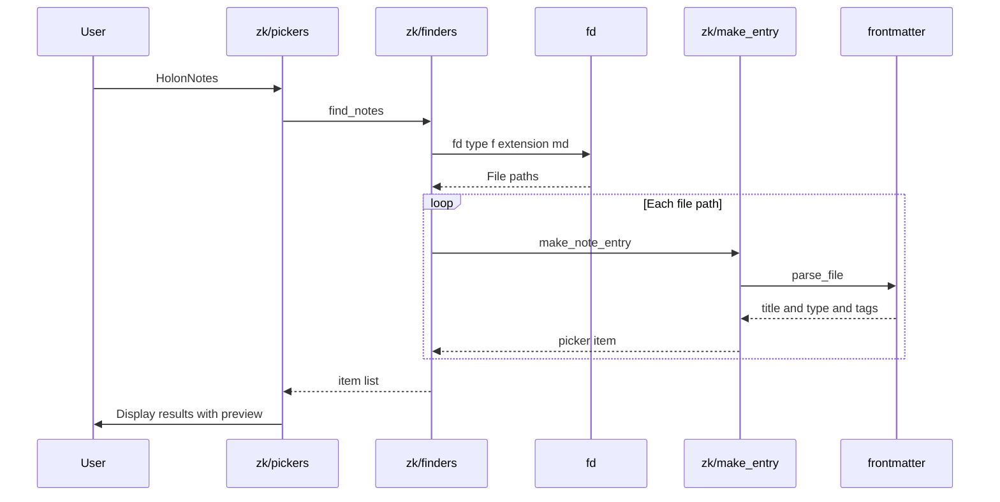

## Tag and Type Filter with Back Navigation

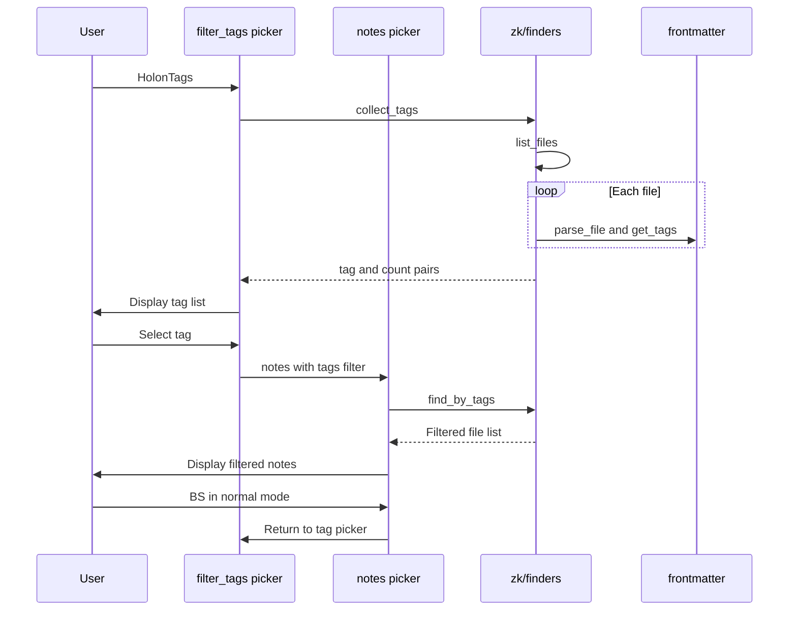

## Note Creation

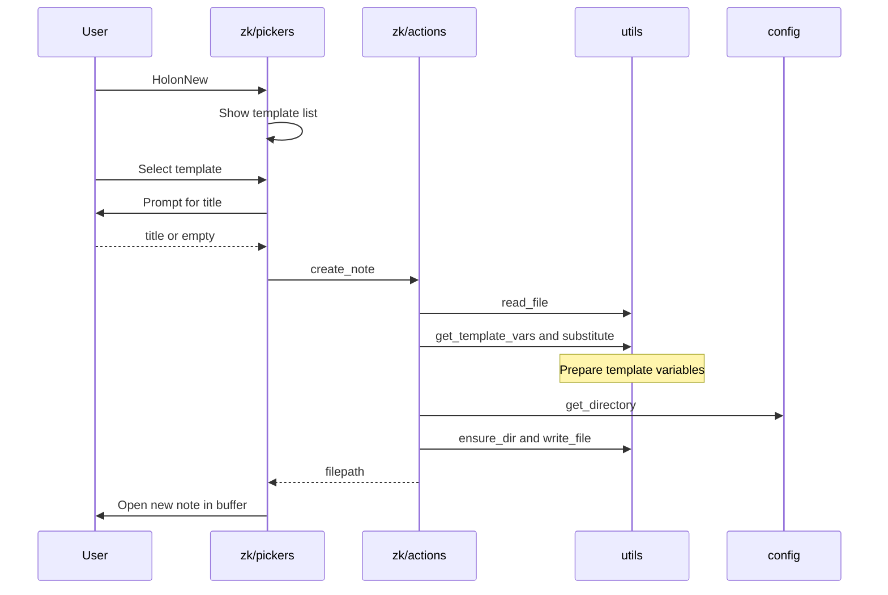

## Link Following

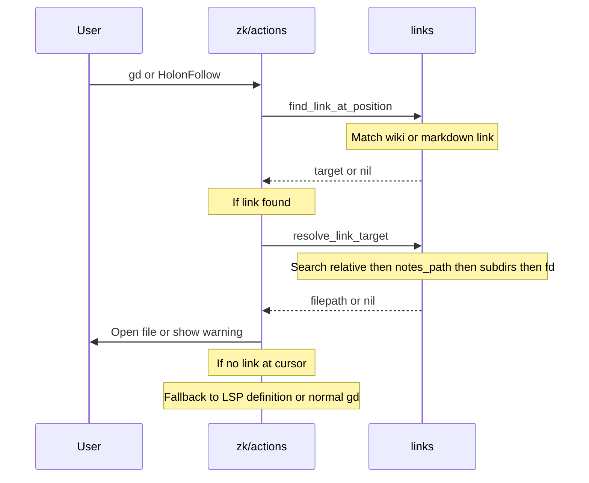

## Backlinks Discovery

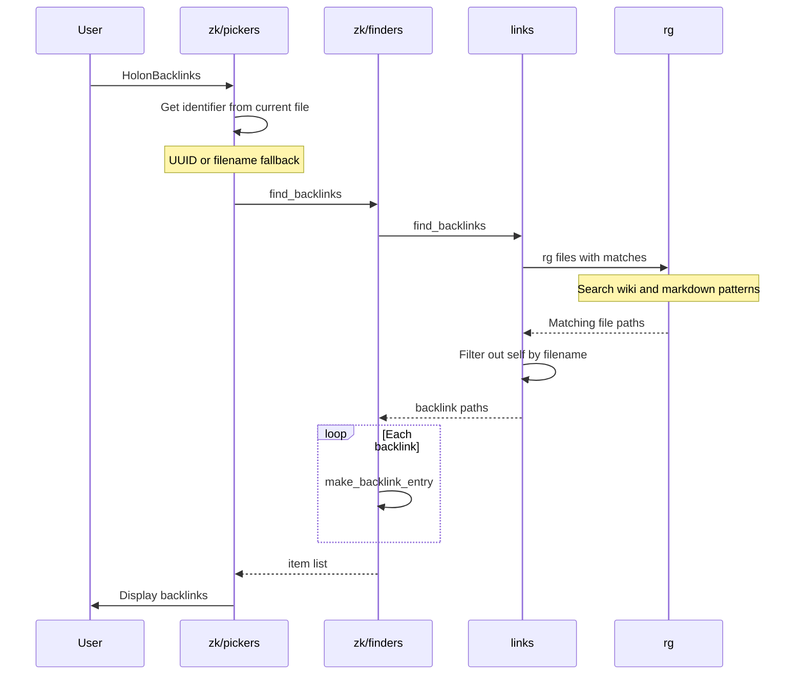

## Index Navigation

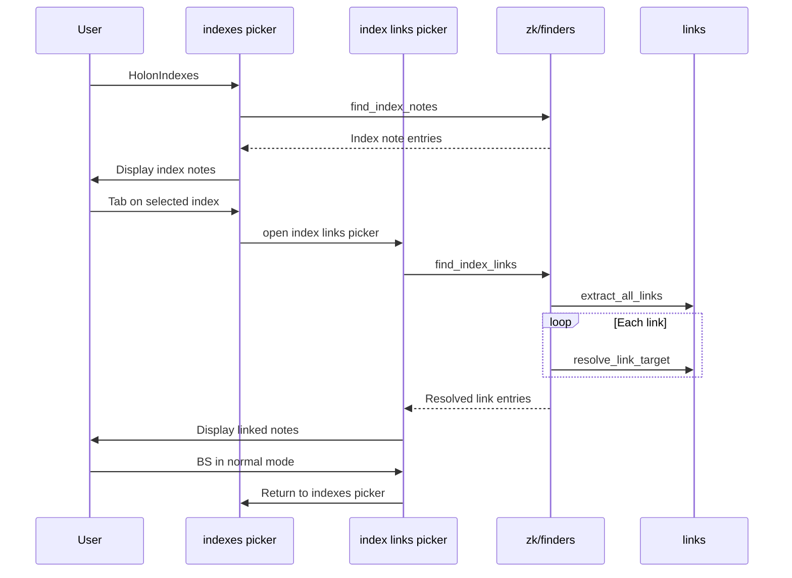

## Insert Link from Picker

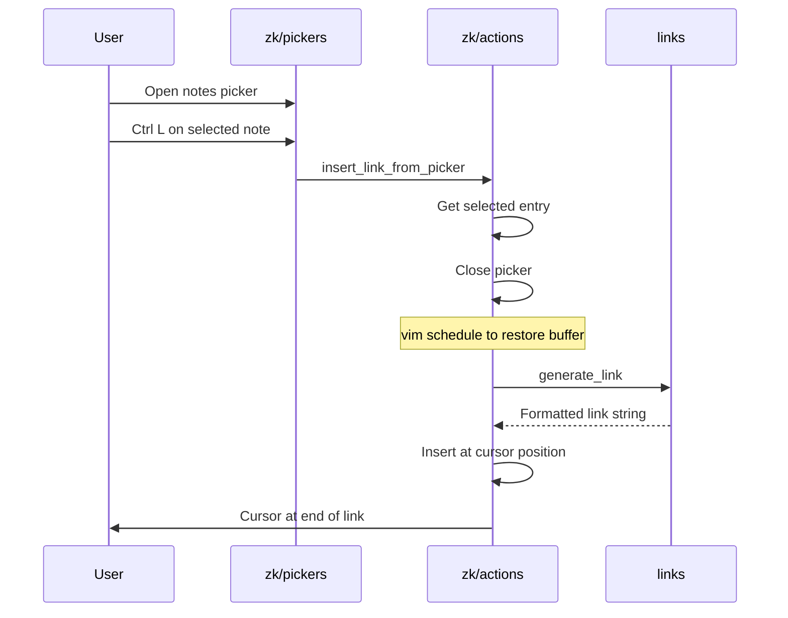

## GTD Board

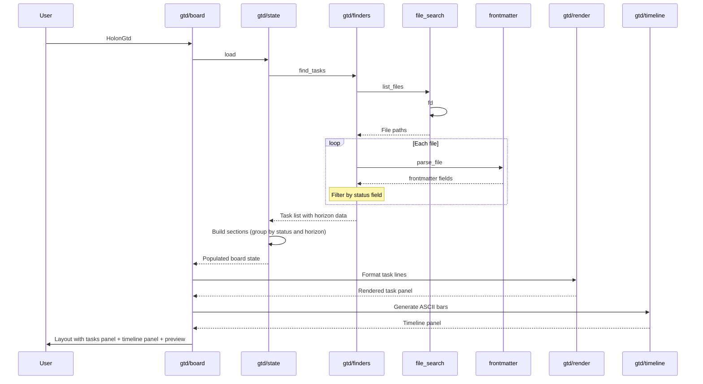

## Link Browser

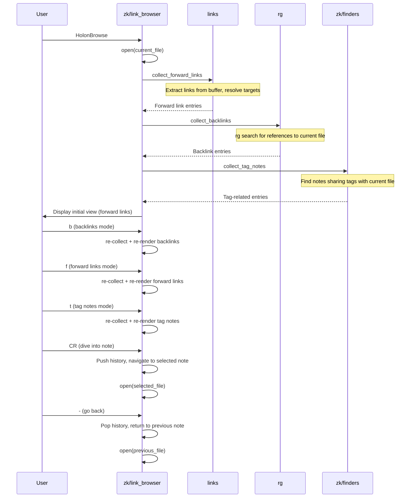

## gd Mapping Persistence

The `gd` mapping for link-following must survive LSP attachment, which
typically overwrites buffer-local `gd` with `vim.lsp.buf.definition()`.

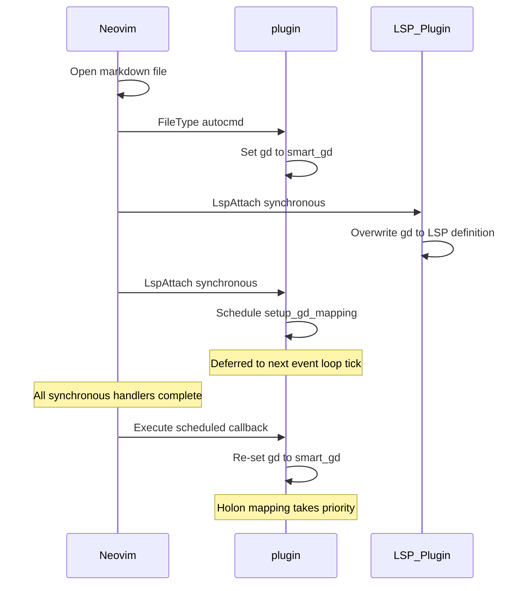

## File Discovery Strategy

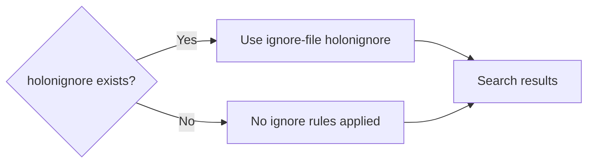

Both paths use `fd --hidden --no-ignore` for file discovery and
`rg --hidden --no-ignore-vcs` for content search. The `.holonignore`
file is the sole source of exclusion rules when present.

## Module Directory Structure

```
lua/holon/
├── init.lua           # Entry point (lazy-load registry)
├── config.lua         # Configuration management
├── utils.lua          # Shared utilities
├── frontmatter.lua    # YAML frontmatter parsing
├── links.lua          # Link extraction and resolution
├── graph.lua          # Directed link graph
├── file_search.lua    # fd/rg command infrastructure
├── picker.lua         # Reusable float window picker
├── zk/                # Zettelkasten modules
│   ├── finders.lua    # Note discovery and filtering
│   ├── actions.lua    # Note operations (create, follow, insert link)
│   ├── make_entry.lua # Picker entry formatting
│   ├── pickers.lua    # Picker definitions
│   └── link_browser.lua # Link graph navigator
└── gtd/               # GTD modules
    ├── finders.lua    # Task discovery and horizon computation
    ├── state.lua      # Board state management
    ├── render.lua     # Task panel rendering
    ├── board.lua      # Board UI orchestration
    ├── timeline.lua   # ASCII timeline visualization
    └── calendar.lua   # Date picker component
```
